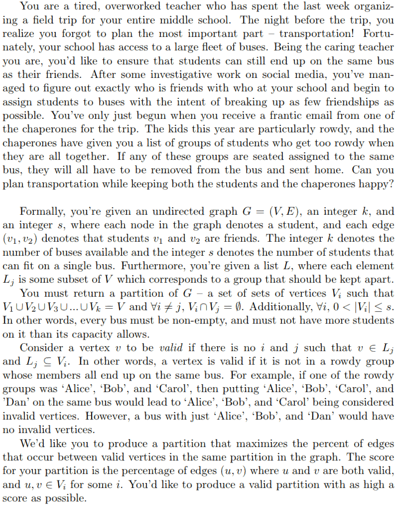

# Efficient Algorithms and Intractable Problems (CS170) Course Project.
This was the main programming project done in the course. The goal was to approximate a solution to an NP-Hard problem (detailed in the section below). We had a little over 5 weeks to do this project and we could be in groups of 3. 

During the first 2 weeks, each group had to come up with 3 instances (small, medium and large) of the problem. Then at the end of week 2, all of the group's problem instances were consolidated and distributed.
 
For the remaining 3 weeks, each group wrote a program that would approximate any given instance of the problem. Then, each group ran their program on every group's problem instance and submitted their approximations. Groups were ranked against one another and said ranking was part of the group's grade. Lastly, each group had to do a write up detailing their approximation.

## Problem Statement
<p align="center">
  
</p>

## Input Format
Each input consists of two files inside of a directory, `graph.gml` and `parameters.txt` (with those exact names), where the name of the directory denotes the identifier of that input. 

> `graph.gml` contains the children and friendship graph in the GML file format. Note that the labels of the vertices in said graph must be unique alphanumeric strings.

> `parameters.txt` is a text file and will start with two integers each on their own line; the first being `k`, the number of buses and the second being `s`, the number of students that fit on each bus. Every subsequent line will contain a non-empty list of vertices which compose a single "rowdy group” that should not all belong to the same bus. Additionally, this file should end in an empty new line. 
>
> Sample `parameters.txt` content:
> ``` 
> 3
> 5
> [‘Harry’, ‘Hermione’, ‘Ron’] 
> [‘Ron’, ‘Fred’, ‘George’] 
> [‘Malfoy’, ‘Crabbe’, ‘Goyle’]
> ```

For a single input, the name of the directory that contains the above two files denotes the identifier of that input.


## Output Format
For each input (directory) a single output file is generated with the name `<input_dir_name>.out`. Each line of this file will be one non-empty list containing one of the subsets in the partition of the graph (aka a bus assignment). There are a total of `k`, the number of buses, lists in this file.

Sample output file:
```
[‘Harry’, ‘Hermione’, ‘George’]
[‘Ron’, ‘Malfoy’, ‘Fred’] 
[‘Crabbe’, ‘Goyle’]
```

## Leaderboards
Groups were ranked against one another. Rank was determined by the average of the individual output scores across each group's input. The output score of an input is `f/t` where `f` is the number of friendships in the output and `t` is the total number of friendships possible (so `t` = `|E|` of the input graph). 

**Our rank:**
This script ranked 28/300. 

Proof can be found [here](readme_assets/rank.png) and [here](readme_assets/rank_total.png).

## Misc
* The write-up that overviews our implementation can be found [here](research/design_doc.pdf).
* The readme for the solver script can be found [here](solver_README.pdf)
* The input generation files can be found [here](input_generator)
